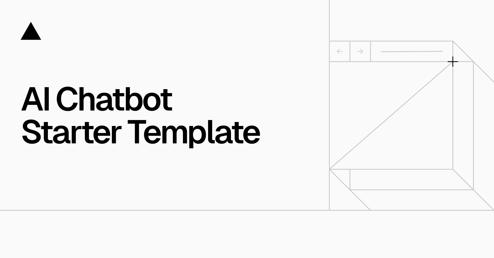

# Tumi’s AI Chatbot Learning Project

A full-stack AI chatbot learning project maintained by Tumi. This repository started from [Vercel’s AI Chatbot template](https://github.com/vercel/ai-chatbot); the original attribution and Apache 2.0 license are preserved.

## Project additions

- An opt-in embedded PostgreSQL database for local development, using PGlite and the existing Drizzle migrations.
- Authentication routing fixes and a chat ownership check before saving messages.
- A clear message when an AI provider key has not been configured.

These additions were developed with AI assistance. This is a learning project, not a production-ready hosted service.

## Run locally

Use Node.js 20 or later and pnpm. Clone the repository, then run `pnpm install --frozen-lockfile`.

Create `.env.local` with the following values:

```dotenv
AUTH_SECRET=replace-with-a-random-secret
AUTH_URL=http://localhost:3000
LOCAL_DATABASE_PATH=.local-data/postgres
OPENAI_API_KEY=your-own-key
```

Generate an authentication secret with `openssl rand -hex 32`. Keep your API key on the server and never commit `.env.local`.

```sh
pnpm db:migrate:local
pnpm dev
```

Open http://localhost:3000/register to create a local account. The default Small model uses OpenAI. AI requests use your provider account and may incur usage charges. The reasoning model additionally requires `FIREWORKS_API_KEY`; file uploads require `BLOB_READ_WRITE_TOKEN`.

Accounts and chats persist in `.local-data/postgres`. This directory is excluded from Git. Local registration does not include email verification, password recovery, or abuse controls.

## Hosted deployment

The embedded database is for local development only. For hosting, remove `LOCAL_DATABASE_PATH`, configure a hosted `POSTGRES_URL`, and apply the original database migrations. Configure authentication and provider secrets in the host’s environment settings. Add rate limits, spending controls, and access controls before inviting public traffic.

Making this repository public publishes its source code; it does not deploy the app or publish your local accounts and conversations.

## Original template documentation

<a href="https://chat.vercel.ai/">
  
  <h1 align="center">Next.js AI Chatbot</h1>
</a>

<p align="center">
  An Open-Source AI Chatbot Template Built With Next.js and the AI SDK by Vercel.
</p>

<p align="center">
  <a href="#features"><strong>Features</strong></a> ·
  <a href="#model-providers"><strong>Model Providers</strong></a> ·
  <a href="#deploy-your-own"><strong>Deploy Your Own</strong></a> ·
  <a href="#running-locally"><strong>Running locally</strong></a>
</p>
<br/>

## Features

- [Next.js](https://nextjs.org) App Router
  - Advanced routing for seamless navigation and performance
  - React Server Components (RSCs) and Server Actions for server-side rendering and increased performance
- [AI SDK](https://sdk.vercel.ai/docs)
  - Unified API for generating text, structured objects, and tool calls with LLMs
  - Hooks for building dynamic chat and generative user interfaces
  - Supports OpenAI (default), Anthropic, Cohere, and other model providers
- [shadcn/ui](https://ui.shadcn.com)
  - Styling with [Tailwind CSS](https://tailwindcss.com)
  - Component primitives from [Radix UI](https://radix-ui.com) for accessibility and flexibility
- Data Persistence
  - [Vercel Postgres powered by Neon](https://vercel.com/storage/postgres) for saving chat history and user data
  - [Vercel Blob](https://vercel.com/storage/blob) for efficient file storage
- [NextAuth.js](https://github.com/nextauthjs/next-auth)
  - Simple and secure authentication

## Model Providers

This template ships with OpenAI `gpt-4o` as the default. However, with the [AI SDK](https://sdk.vercel.ai/docs), you can switch LLM providers to [OpenAI](https://openai.com), [Anthropic](https://anthropic.com), [Cohere](https://cohere.com/), and [many more](https://sdk.vercel.ai/providers/ai-sdk-providers) with just a few lines of code.

## Deploy Your Own

You can deploy your own version of the Next.js AI Chatbot to Vercel with one click:

[](https://vercel.com/new/clone?repository-url=https%3A%2F%2Fgithub.com%2Fvercel%2Fai-chatbot&env=AUTH_SECRET,OPENAI_API_KEY&envDescription=Learn%20more%20about%20how%20to%20get%20the%20API%20Keys%20for%20the%20application&envLink=https%3A%2F%2Fgithub.com%2Fvercel%2Fai-chatbot%2Fblob%2Fmain%2F.env.example&demo-title=AI%20Chatbot&demo-description=An%20Open-Source%20AI%20Chatbot%20Template%20Built%20With%20Next.js%20and%20the%20AI%20SDK%20by%20Vercel.&demo-url=https%3A%2F%2Fchat.vercel.ai&stores=[{%22type%22:%22postgres%22},{%22type%22:%22blob%22}])

## Running locally

You will need to use the environment variables [defined in `.env.example`](.env.example) to run Next.js AI Chatbot. It's recommended you use [Vercel Environment Variables](https://vercel.com/docs/projects/environment-variables) for this, but a `.env` file is all that is necessary.

> Note: You should not commit your `.env` file or it will expose secrets that will allow others to control access to your various OpenAI and authentication provider accounts.

1. Install Vercel CLI: `npm i -g vercel`
2. Link local instance with Vercel and GitHub accounts (creates `.vercel` directory): `vercel link`
3. Download your environment variables: `vercel env pull`

```bash
pnpm install
pnpm dev
```

Your app template should now be running on [localhost:3000](http://localhost:3000/).

